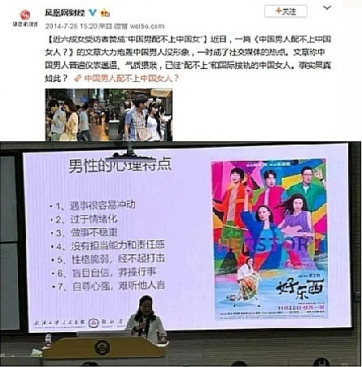
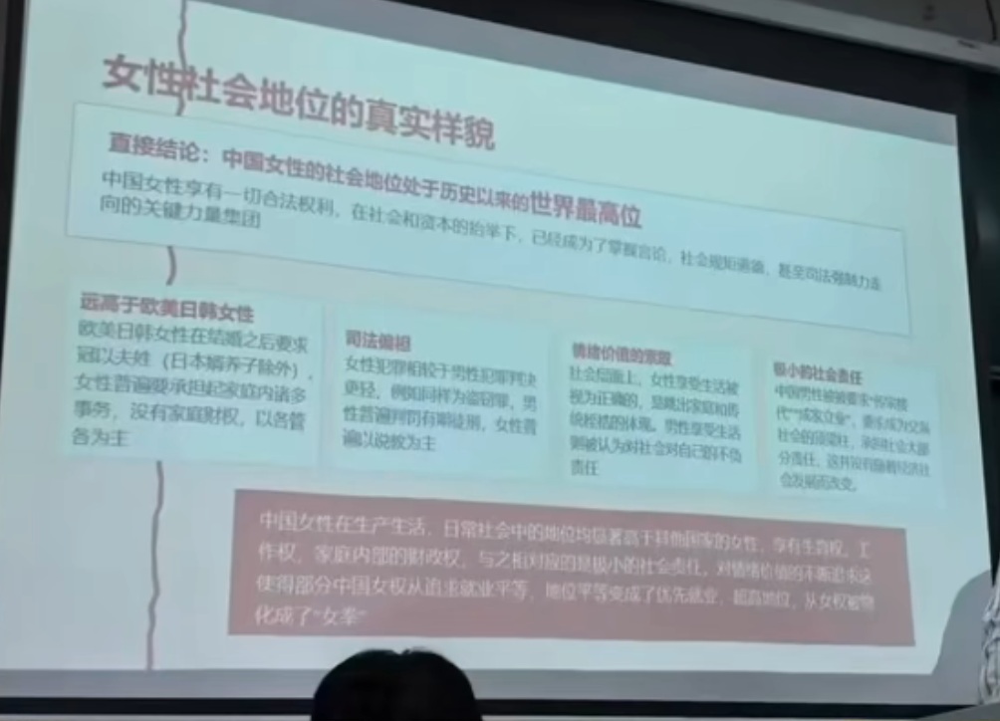
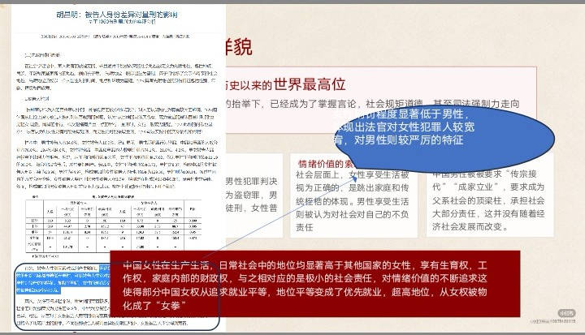
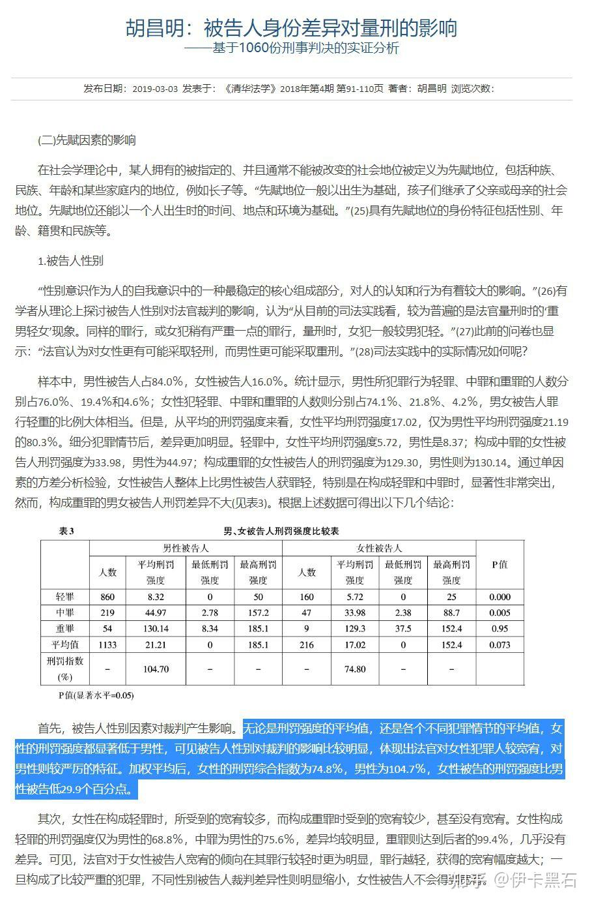

> [!NOTE] 读前须知
> 1. 原文呈现形式为幻灯片（PPT），此处以 Markdown 文档形式呈现，在形式、排版上与原文有一定差异；
> 2. 此文字稿综合各家引用此文章的视频、专栏等对文章框架顺序、内容进行尝试复原，无法保证与原文 100% 一致；
> 3. 考虑 Markdown 易读性、美观性，此处移除与原文弱相关的配图，仅保留原文中与内容高度相关的图片；
> 4. 文章版权归原作者所有，为保护作者个人信息，此处暂定署名为杭州师范大学某学生；
> 5. 原文中所有标红且起强调作用的字，在此处正文均以加粗形式呈现;
> 6. 原文（课件）图片已归档，详情见[「杭州师范大学马原演讲」相册](https://stridenotstrike.netlify.app/gallery/marxism-vs-feminism/)。

以下为原文转化成的文字稿，仅供参考，具体内容请以原始文件为准。

------

# 让马克思主义告诉你为什么女拳打不起来
基于历史唯物主义与阶级分析的再审视——资深 8u

杭州师范大学某学生

## 目录
1. 引言与概念界定
    - 核心问题与概念界定•马克思主义的妇女观基本准则
    - 区分合理女权诉求与过度「诉求」表现

2. 典型案例分析
    - 事件还原与关键事实
    - 马克思主义视角下的多维剖析

3. 马克思主义的系统性批判
    - 三大核心批判点

4. 马克思主义的替代方案
    - 从反男到反资本主义：重构批判对象
    - 阶级有限与劳动社会化：构建解决路径

5. 结论与反思
    - 对当代女性主义运动的总结与反思
    - 必要的区分：激进与科学、表象与本质

# 第一部分：引言与概念界定
### 为什么会存在这个问题
首先我们要承认的是，女权运动是为了维护女性权益所开展的正当社会性革命，其目的是为了打破原有对女性的压迫，受到社会一致认可。

但是，近年以来社会上逐渐形成以「女性独立」「反对父系社会」等为噱头的「女拳主义」。鼓吹女性生来尊贵地位高于男性，要求社会偏袒女性，扭曲社会客观事实，抹黑男性付出，我认为这是由于经济发展中社会精神文明没有随之发展导致的。

### 「女拳」的界定与特征
1. 脱离阶级矛盾  
  将性别压迫视为社会唯一矛盾，忽视资本对全体劳动者的剥削本质，甚至成为资本的忠实奴仆。
2. 制造绝对对立  
  构建僵化的「男性—压迫者」与「女性—被压迫者」二元框架，割裂全体利益。
3. 追求形式平等至上  
  过分强调一切领域的无差别形式，平等忽略历史与现实条件下的实质不平等。
4. 话语与符号斗争优先  
  将斗争重心完全置于语言符号等上层建筑领域，轻视经济基础的决定性作用。

## 马克思主义的妇女观基本原则
> 在历史上出现的最初的阶级对立，是同个体婚制下的夫妻间的对抗的发展同时发生的。而最初的阶级压迫是同男性对女性的压迫同时发生的。  
——恩格斯《家庭、私有制和国家的起源》

1. 妇女受压迫的起源——私有制  
  妇女的从属地位并非天然存在，而是随**私有制**出现而产生男性。为确保私有财产由亲生子继承，建立专有制家庭，将妇女禁锢于家庭内部。使其丧失参与社会生产的权利，从而在经济上彻底依附于男性。这一观点揭示了性别压迫的经济根源。

2. 经济基础决定上层建筑  
  马克思主义认为，性别关系和性别观念作为社会上层建筑的一部分，其本质的表现形式最终取决于社会的生产关系。因此，要真正改变能力不平等的现状。必须从**变革产生这种不平等的经济基础**入手，而不能仅停留于观念层面的呼吁。

3. 阶级压迫是更根本的压迫  
  在阶级社会中，人与人之间的关系首先是阶级关系。**性别压迫**往往是阶级压迫的一种特殊表现形式。若将所有男性都视为压迫者，就会模糊阶级界限，转移斗争方向，最终削弱整个**无产阶级**争取解放的共同力量。

## 区分合理女权诉求与「过度」表现
### 合理诉求：基于平等与反压迫的正当权利
1. 同工同酬  
  反对劳动力市场上基于性别的歧视，确保劳动价值的平等回报，打破对女性的片面化认识。
2. 反性别暴力  
  反对家暴与一切形式的性别暴力，捍卫基本的人身安全与人权底线。
3. 生育与职业支持  
  拒绝将女性物化为生育的工具，保证女性也有对应的就业权利和生育自由。
4. 机会平等  
  打破旧有的男性优先，强调同台平等竞争，做到保证女性利益的相对平等。

### 「过度」表现：偏离阶级分析的误区
1. 全盘否定性别差异  
  无视生理与社会分工差异，机械地要求绝对一致的对待方式。
2. 割裂阶级与性别  
  忽视底层男性同样面临的阶级压迫，模糊了共同的斗争对象。
3. 归咎于男性个体  
  将结构化压迫简化为两性个体间的对立，制造不必要的社会撕裂。
4. 追求符号化「胜利」  
  沉溺于语言禁忌与文化符号的争夺，忽略经济与政治结构的根本变革。

# 第二部分：典型案例分析
**以小红书、武汉某高校为代表的女拳言论**  

<!--   -->

> [!NOTE] 图片文字概述
> 

> 

> 

>
> 原文配图一：[凤凰网财经](https://news.sina.cn/sa/2014-07-26/detail-ikmyaawa6056671.d.html?vt=4)于 2014 年 7 月 26 日发布的推文《近六成女受访者赞成「中国男配不上中国女」》），原文内容如下：  
> > 近日，一篇《中国男人配不上中国女人？》的文章大力炮轰中国男人没形象，一时成了社交媒体的热点。文章称中国男人普遍仪表邋遢、气质猥琐，已经“配不上”和国际接轨的中国女人。事实果真如此？_（原文此处为《中国男人配不上中国女人？》链接但指向不明）_
>  
> 原文配图二：武汉某高校教师在校内的授课图，其中授课的课件引用女性向影视作品《好东西》宣传海报，图片左侧配文如下：  
> > **男性的心理特点**
> > 1. 遇事很容易冲动
> > 2. 过于情绪化
> > 3. 做事不稳重
> > 4. 没有担当能力或责任感
> > 5. 性格脆弱，经不起打击
> > 6. 盲目自信，莽撞行事
> > 7. 自尊心强，难听他人言
> 

**事件概述：**

大量女性认为自己经由高等教育，国际接轨之后，拥有了不凡的实力和内在，这与她们所体会到的女性地位不符合，于是通过贬损中国男性的社会地位，否定中国男性的贡献，来提高自己的社会地位，认为自己才是社会的核心。

提出要从根本上改变父系社会，甚至有想要回到母系社会的言论出现。认为女性可以完成男性的所有工作，「男性没有存在的必要」。

尤其让人不理解的是，大部分「女拳」主义者对欧美、非洲男性抱有特别的好感，认为欧美男性「绅士有风度」`(《三联生活周刊》)`，认为非洲男性「有男性的气质」，更有甚者认为除了中国男性以外的所有男性都是理想的可托付的优秀男性。

## 女性社会地位的真实样貌
<!--
> [!NOTE] 参考来源
>   
>   
-->

> [!NOTE] 参考来源
>   
>   

直接结论：中国女性的社会地位处于历史以来的**世界最高位**  

中国女性享有一切社会合法权利，在社会和资本的抬举下，已经成为了掌握言论、社会规矩、道德，甚至司法强制力走向的关键力量集团。

### 远高于欧美日韩女性
欧美日韩女性在结婚之后要求冠以夫姓（日本嫡养子除外）。女性普遍强调要承担起家庭内诸多事务，没有家庭财权，以各管各为主。

### 司法偏袒
女性犯罪相较于男性犯罪判决更轻，例如同样为盗窃罪，男性普遍判罚有期徒刑，女性普遍以说教为主。  
<!--  -->
  

> [!IMPORTANT] 原文注解
> 女性刑罚程度显著低于男性，体现出法官对女性犯罪人较宽宥，对男性则较严厉的特征。

### 情绪价值的索取
社会层面上，女性享受生活被视为正确的，是跳出家庭和传统桎梏的体现。男性享受生活则被认为对社会对自己的不负责任。

### 极小的社会责任
中国男性被要求「传宗接代」「成家立业」，要求成为父系社会的顶梁柱，承担社会大部分责任，这并没有随着经济社会发展而改变。

中国女性在生产生活、日常社会中的地位均显著高于其他国家的女性，享有生育权、工作权，家庭内部的财政权，与之相对应的是极小的社会责任，对情绪价值的不断追求，这使得部分中国女权从追求就业平等、地位平等变成了优先就业、超高地位，从女权被物化成了「女拳」。

# 马克思主义分析
## ①「身份政治」对阶级团结的破坏
### 推定既论事实
中国女拳追求的社会地位和情绪价值，本质上是让女性小布尔乔亚（小资产阶级）化，脱离无产阶级，对于情绪价值等的追求实则是对小资产阶级生活方式的追求。

> [!TIP] 原理引用：阶级斗争是历史发展的根本动力  
> 
> 至今一切社会的历史都是阶级斗争的历史。  
> ——马克思、恩格斯《共产党宣言》

- 制造身份对立  
    将「女性」身份标签视为唯一政治坐标，将所有男性视为潜在威胁，将无产阶级和资产阶级的对立偷换为男性和女性的对立。

- 消解阶级意识  
    资本并不直接下场，而是使用女拳作为代言人，包装美好的小资产阶级生活吸引大量女性作为代理人，与广大无产阶级对抗。

- 认知的局限性  
    缺乏深刻的阶级分析能力，容易将个人的主观感受和局部问题，放大为普遍性的性别矛盾，无法认清社会压迫的本质来源。

结论：过度强调的「性别优先」逻辑，本质上是「身份政治」取代了马克思主义的「阶级优先」逻辑，造成了无产阶级内部的分裂动荡，陷入了资本主义的陷阱中。

## ②个人主义与「小资产阶级软弱性」
### 阶级特性分析：要求更高地位背后的逻辑
**前提条件：女拳者大多数并没有过硬示例，需要依靠贬损他人来相对提高自己**（董明珠不会是女拳，杨景媛只能是女拳）。
- 动摇性与不彻底性：自身不具备追求更高社会地位的实力，需要借助外部力量，同时不屑于提升自己；
- 软弱性与推卸责任：不敢直面并承担后果，守株待兔坐享其成，将自己的不成功归结为他人的干扰；
- 个人主义至上：将自我感受与「维权者」的道德形象置于客观事实之上，维护个人虚荣心，漠视他人被误解的权利。

### 经典论断引用
> 它们看问题比较片面，容易产生个人主义、自由主义和无政府主义倾向。  
> ——毛泽东《中国社会各阶层的分析》

### 批判性结论
过度强调性别对立的女拳主义，可能异化为一种 **「逃避个人责任的意识形态庇护所」**。将个人的主观臆断与道德过错，强行归因于抽象的「结构性压迫」，从而消解了具体的个人道德责任，反而将矛头对准了社会和无产阶级。

## ③女拳有且仅有的出拳方式
依靠社会对女性的容忍，女拳对无产阶级团结的破坏：

1. 向上索取地位  
    受到欧美[波伏娃](https://baike.baidu.com/item/%E8%A5%BF%E8%92%99%E5%A8%9C%C2%B7%E5%BE%B7%C2%B7%E6%B3%A2%E4%BC%8F%E5%A8%83/176547)等人的影响，要求更高的社会地位和更多的精神价值，强迫社会满足其无理需求，如拒绝吊牌羞耻，利用生育假诈骗，歧视劳动百姓。

2. 公共羞辱  
    通过网络平台迅速公开曝光，利用舆论场进行「标签化」归类与道德审判，煽动公众情绪，对当事人进行社会性死亡的施压，将个例进一步推广到全体中国男性，对中国男性地位进行全面打压。

3. 反向扮演受害者  
    在事件进一步披露后，拒绝真诚道歉，转而强调自身作为「女性」的脆弱感与恐惧感，试图将批评转化为对自身的二次伤害，博取舆论同情。（燕冬萍拒不认错，马蓉强调自己受害，杨景媛至今没有出面道歉）

4. 举证责任倒置  
    利用「你没做亏心事为什么怕」「解释就是掩饰」等诡辩逻辑，将自证清白的责任强加于被指控者，将正常的辩解视为心虚的表现，强词夺理，利用社会对女性的偏袒诬陷无过错方。

**本质分析：零和博弈下的信任消解**  
这种模式将性别关系异化为充满猜忌与敌意的零和博弈。它不仅对被冤枉的个体造成实质性伤害，更毒化了整个社会的互信基础，使正常的人际交往充满警惕。将个人冲突上升为「性别战争」的操作，不仅无助于解决结构性的性别不平等问题，反而会撕裂社会共识，削弱阶级团结，最终损害的是真正追求平等与正义的进步事业。

# 第三部分：马克思主义对女拳的系统性批判 
## 批判一：脱离阶级分析，掩盖真实矛盾
**核心原理**：阶级矛盾是资本主义社会一切冲突的根本矛盾，而不是抽象的性别对立。忽视阶级视角的斗争，本质上是对历史唯物主义的背离。

**批判与驳斥**：女拳常将女性受压迫的根源简单归结为抽象的「父权制」或个体层面的「男性」，将斗争的矛头错误地对准了同为受压迫者的男性同学，而非真正掌握生产资料的学校管理层或背后的资本力量。这不仅掩盖了资本对两性劳动者的双重压迫，更转移了社会斗争的大方向。

## 批判二：经济基础决定论的缺失——脱离生产力谈解放
> [!TIP] 原理  
> 
> 只有在消除了资本主义生产对两性关系的影响，并使女性大规模参加社会生产，妇女解放才可能真正实现。  
> ——恩格斯

女拳往往沉迷于符号与话语的斗争，忽视了女性实现**经济独立**和参与**改造生产关系**的根本重要性，使冲突始终停留在观念层面，无法触及物质利益的改变。

## 批判三：制造抽象对立，违背唯物辩证法
**核心原理**：马克思主义强调，无产阶级的彻底解放，绝不能依靠孤立的个人奋斗，而必须依靠阶级力量的联合，依靠团结的集体行动与共同斗争。

**现实驳斥**：部分激进观点刻意将复杂的两性关系简单粗暴地简化为「压迫者—受害者」的二元对立框架。中国社会最主要的矛盾是人民美好生活需要和不平衡不充分发展之间的矛盾，这也是女性进一步提高社会地位的最大阻碍。然而却被资本势力极化为男女之间的对立，这是在无产阶级内部搞分裂，忽视唯物辩证法。

## 批判四：极端个人主义倾向，瓦解集体斗争
**核心原理**：矛盾是普遍存在的，但唯物辩证法要求我们分析具体矛盾，在复杂事物的发展过程中，要着重把握主要矛盾和矛盾的主要方面。

**现实驳斥**：部分极端化的叙事将主观情绪作为最高判断准则，例如以我要追求更高的精神价值和社会地位为目标，强制要求他人配合。这种将**个人感受凌驾于客观事实与他人基本权利之上**的逻辑，本质上是资产阶级个人主义的翻版，它在无形中将集体割裂为原子化的个体，消解了针对共同结构性问题进行集体抗争的社会基础。

## 批判五：历史唯心主义——用心理／话语取代物质分析
**核心原理**：马克思主义唯物史观强调：社会存在决定社会意识。一切观念形态的根源，最终要追溯到特定历史时期的生产力发展水平与生产关系结构中去。

**视角驳斥**：女权往往陷入「唯观念论」，将性别压迫根源简单归结为「话语霸权」或「心理恐惧」。这是本末倒置的。

不触及并改造现实的**物质生产关系与经济基础**，而仅在观念层面争夺「谁有权质疑谁」的话语权，终究只是「治标不治本」的表面抗争。

女性想要提高社会地位的根本途径是加入无产阶级改革中，通过解放生产力的方式获得地位，而不是贬损男性地位，这样只会使得历史倒退。

# 第四部分：女拳争取权益的方式必将改变 
## 不是反男，而是反资本主义
- 马克思主义方案  
    妇女彻底解放的路径是**消灭私有制**和**消灭阶级**。这是解决性别压迫的根本前提，而非停留在性别对立的表象。

- 压迫的根源辨析  
    女性受压迫的根源在于私有制下的家庭经济依附关系和劳动力商品化逻辑。真正的敌人从来不是身边的男性个体，而是将人异化为商品的雇佣劳动制度与资本逻辑。

## 阶级优先，而非性别优先
- 核心策略  
    在阶级社会中，性别压迫本质上是阶级压迫的一种特殊表现形式。因此，必须优先联合**所有被剥削者（不分性别）**，共同推翻资产阶级统治。性别不平等问题，也只有在这一历史过程中才能得到根本解决。
    
- 场景的现实映射  
    男女之间并不存在根本利益冲突，中国人民自始至终都有着同样的奋斗目标，就是实现中华民族的伟大复兴。我们的敌人是境外势力，是残存资本，而不是以性别决定对立。

我们提到，女拳主义者并没有过硬实力，以参加生产为耻，不劳而获为荣。

## 真正的解放：参加生产的女性才会解放
### 01／构想与实践
> 妇女解放的重要前提是参加社会生产，而这又依赖于家务劳动的社会化。  
> ——弗里德里希•恩格斯

1. 参加生产  
    女性必须要参与工作，形成工作—收获的因果链，全面击碑女拳者不劳而获的幻梦。
2. 工作保障  
    形成平等就业的社会风气，各岗位依照岗位特色招收员工，打造一个良好就业平台。
3. 生育保障  
    生理结构决定了女性在某些情况下必须享有一些特殊权益，需要提供相应的保障。
4. 技术赋能  
    利用现代科技减轻女性在家庭的负担，让女性拥有工作的时间，打破传统的桎梏。

### 02／历史的印证
**历史探索与当代实践的双重验证**  
随着各国女权的发展，女性参加工作的比率大大提升。女性也成功打破了传统负责全家的家庭地位，从一人变为双方共同承担，将女性从繁重的家庭劳动中解放出来参加工作。可以看到的是，女性参加生产后，女性地位显著提高，英国、韩国、冰岛、意大利均出现了女性政治领袖，也出现了格力、沃尔玛、AMD 等优秀的有女性领导的集团公司。

# 第五部分：结论与反思 
### 女拳的必然失败
女拳主义是对无产阶级内部的分裂，同时是生产力发展的阻碍，必将在经济社会的不断朝前发展中消失，女拳者也终将被送上马克思主义的绞刑架。

### 女性权益的争取
在中国女性地位已经超然的情况下，女性依旧可以依靠参加生产来争取自己的权益。劳动者不会歧视劳动者，只有女拳才会歧视依靠自己劳动争取权益的人。只有实际参加了生产活动，女性权益才能获得进一步提升。

### 马克思主义的指导
马克思主义将性别压迫置于阶级、种族、资本的宏大结构中综合分析，鲜明的点出了女拳运动的实质，批判了这种逆发展行为，给出了女性争取权益的道路。

**最终结论：**

马克思主义提供的不是一种「女权主义」，而是一种更高维度、更彻底的人类解放理论。它超越了单纯的性别视角，深刻揭示了妇女受压迫的经济根源，并指出了实现彻底解放的科学路径——即通过消灭私有制和阶级压迫，达成全人类的自由与解放。

## 必要的区分与提醒
### 划清界限：支持正当权益
批判女拳绝不等于反对女性争取自身合法权益的斗争。我们坚决支持女性在法律和道义框架内，为争取同工同酬、反家暴、反歧视等平等权利而进行的一切正当努力。我们欣赏每一位劳动者，崇拜任何一个依靠自己生产劳动获取地位和尊严的人。我们驳斥女拳，同样也驳斥任何以各种方式侵害他人利益，破坏内部团结的敌人。

### 警惕：拒绝制造分裂
真正的性别平等，不是建立在对另一性别的仇恨和对立之上，而是建立在消灭阶级剥削、实现人类共同解放的基础之上。在当前复杂的社会环境中，我们需要警惕那些打着「女权」旗号制造分裂的思潮。唯有坚持马克思主义的阶级分析方法，才能看清迷雾。

最终目标：**所有劳动者（不分性别）的共同解放**

# 结语

> ## 如果你觉得被冒犯了，那说的就是你这种人。
> ——杨笠（著名女拳）

愿思辨之光，照亮探索之路。